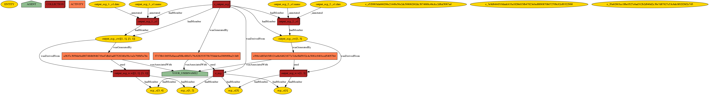

# mProv API

mProv stores **provenance information** using the PROV-DM model.  This represents data and its associations with activities, agents (users), and other entities in a *graph*.  The graph conforms to a spec called [PROV-DM](https://www.w3.org/TR/prov-dm/).

The example above (you may wish to zoom in) shows a visualization of the provenance graph captured by mProv.  This not only shows the user, but also:

* In the "2D rectangle" shape on the top, we have a node at the top representing a *stream* or source as a collection.  As examples, this output stream:
  * Has two sub-streams
  * Has two member tuples (below, as yellow ellipses).
  * Each substream has two annotations, in the upper left.  
* The two stream tuples are aggregated into a sliding window or collection node, which is the bottom of the diamond.  Note that in the general case, not all tuples from a stream will be in the window.
* A computation (represented with the brown node) uses the sliding window to generate an output (rightmost green node).
* We record that the output was derived from the input window.

The provenance graph can, in turn, be *queried* (using either the mProv API or Neo4J Cypher) to discover relationships.
For instance, we can determine which nodes were produced by a given function or activity; we can traverse the graph
to determine which source was used for a given output result; we can find all annotations transitively associated with
our input window (by tracing through the tuples, to the sources, to their annotations).

## mProv Programmatic API

Let's suppose we are running a stream computation through a pipeline of operators (eg in Apache Spark).
We can establish a connection to mProv by instantiating `MProvConnection`.  This constructor takes as input
a user ID and password, as well as a server.

## Basics: Tuples, Annotations, Activities and Outputs

As we read a tuple *t* from the stream, we want to:

1. Create a node *n_t* in our PROV-DM graph representing tuple *t*.  This lets us capture annotations to the tuple, link activities to the tuple, etc.
   We are allowed to store **the whole tuple** (making the PROV structure self-contained) or **a link to the tuple, eg by its ID**, which then requires
   someone to look up the original tuple to get the data.  This is through `store_stream_tuple` (which takes a stream name and a unique ID, eg a 
   monotonic counter) and it returns a **token** or a node ID for the result.
2. We may want to **annotate** the tuple with "metadata", which in our case means key-value pairs that are stored in the provenance database but may not be 
   part of the dataflow in the stream engine.  This is through `store_annotations`, which lets us add a dictionary of key-value pairs to a stored node.
3. We may want to **operate** on the tuple `t` by applying some tuple-at-a-time function `f` (think of a "map" in MapReduce, or a user-defined predicate in SQL), producing `u`.  Here, we capture in the graph a node representing the **operation**.
   the time of the computation, the input, and the output.  This can be achieved via `store_derived_result`.
   
## More Advanced Features: Collection-Valued Data

**Aggregate or Windowed Computations.**  Sometimes we process data in **sliding window** or **aggregate** computation `G` over a set or sequence of tuples `T` instead of one tuple at a time.  
In this case, we should store each tuple from `T` as in (1) above, then call `store_windowed_result` to associate the IDs of the tuples in `T` with a
collection, which are then processed by `G` resulting in a stream output result `u`.

**Annotating sub-streams, sources, or other collections.** At times, we have metadata that applies to an entire source and never changes, or that applies to
a sub-stream.  To represent this, we can create a *collection* representing the stream or sub-stream, annotate the collection, and associate each tuple
with the collection.  To do this, we provide `create_collection`, we allow the user to `store_annotations` on a collection, and we include `add_to_collection` 
to link a tuple to a collection.

**Directly recording relationships.** If the programmer wishes to record a link between existing nodes (e.g., that a collection
was derived from another collection), we provide a series of API calls for this: `store_derived_from`, `store_used`, `store_generated_by`. 

## mProv Querying

mProv also provides programmatic calls to query the provenance graph, given a node:

* `get_node` takes any node ID and returns the tuple contents associated with the node
* `get_code` takes any code definition string and stores it as an entity, then returns a unique ID
* `get_annotations` returns a dictionary of key-value annotations associated with the node
* `get_source_entities` takes an entity node and traces the `wasDerivedFrom` edge to find sources
* `get_derived_entities` takes an entity node and traces back on the `wasDerivedFrom` edge to find derived nodes
* `get_parent_entities` takes an entity node and traces the `hadMember` edge to find containing entities
* `get_child_entities` takes an entity node and traces back on the `hadMember` edge to find sub-entities
* `get_creating_activities` takes an entity node and traces the `wasGeneratedBy` edge to find producing activities
* `get_activity_outputs` takes a activity node and traces back on the `wasGeneratedBy` edge to find output activities
* `get_activity_inputs` takes an activity node and traces the `used` edge to find input nodes

## mProv and Apache SparkSQL

mProv can take Spark SQL queries and **instrument** them to track provenance.  It does this by:

1. Ensuring each relation has a unique `_prov` identifier --- either by concatenating a database-style *key*, or else by associating each tuple with an auto-generated ID.
1. For base tuples that don't have a key, it will generate a `_tab` table
storing the `_prov` column alongside the tuples.
1. For derived tuples, it will generate a `_prov` column comprised of
the `_prov` columns of the source tuples.  For a SPJ query that consists
of an array (one element per source).  For a grouping query that consists
of an array list (concatenating all _prov arrays).

This setup is intended to work only with single-block SQL queries.  If you have multiple blocks, you will want to have a separate (named) query
expression for each block.  This allows us to also capture the computational steps (as each query) in a provenance structure.

### Using SqlProvenance

It's simple to use this code.  Wherever you would call `spark.sql(...)` you instead call `SqlProvenance.create_sql_with_provenance(name, sql, spark_session)`.  This code will:

1. Create any necessary intermediate tables to annotate inputs with provenance.
2. Return a Spark DataFrame that's the result of calling `spark_session.sql` with the rewritten, provenance-annotated SQL query.

In addition, the results of the provenance-annotated query will be saved as a table *name*`_prov`.  This, in turn, will be queriable through the Cypher interface.

## mProv and Apache Spark: Streaming Window Computations

mProv interfaces with Apache Spark, with a focus on instrumenting user-defined functions called through the `pandas_udf`
decorator.  Here, Spark does a GROUP BY on a set of tuples, then calls the UDF with a subset of tuples, collected in a
Pandas dataframe.  (This is done through Apache Arrow.)

Here, a given Spark computation may have many executors on many machines.  Each machine should use mProv's `decorator`
module and the `MProvAgg` decorator.  The decorator will instrument the Pandas UDF with additional code to record
the function invocation, its inputs, and its return values. 

**Connection Cache.** Each time Spark calls MProvAgg on the *same executor node*, we would like to reuse the `MProvConnection`.
The `MProvConnectionCache` allows us to do so.

**Decorator syntax**.
`@MProvAgg(`*input_stream*, *output_stream*, *input_unique_att*, *output_unique_att*, *parent_sub_stream*)

* `input_stream` is the name of the input stream or relation
* `output_stream` is the name of the output stream or relation
* `input_unique_att` and `output_unique_att` are used to determine a *unique key* for each element of the input and output streams, respectively.
A monotonic timestamp is often used.
* `parent_sub_stream` specifies the ID for a PROV-DM node representing the output stream.  Each stream output will be linked to this node
(via a `hasMember` edge).
 